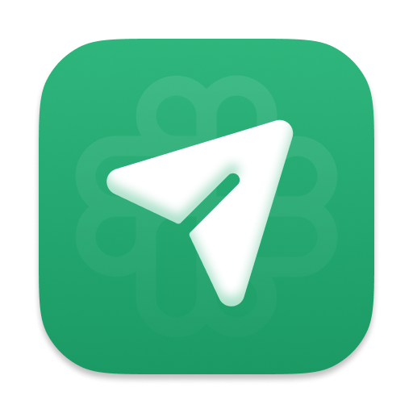
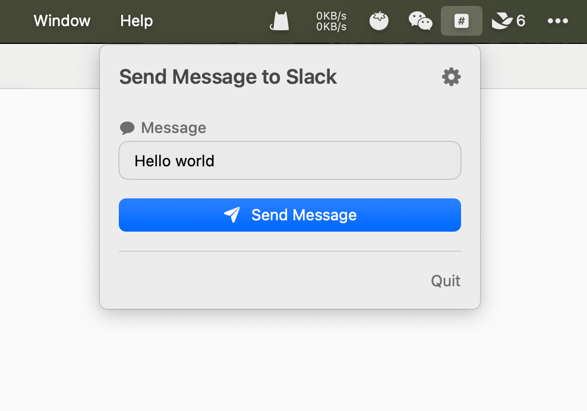
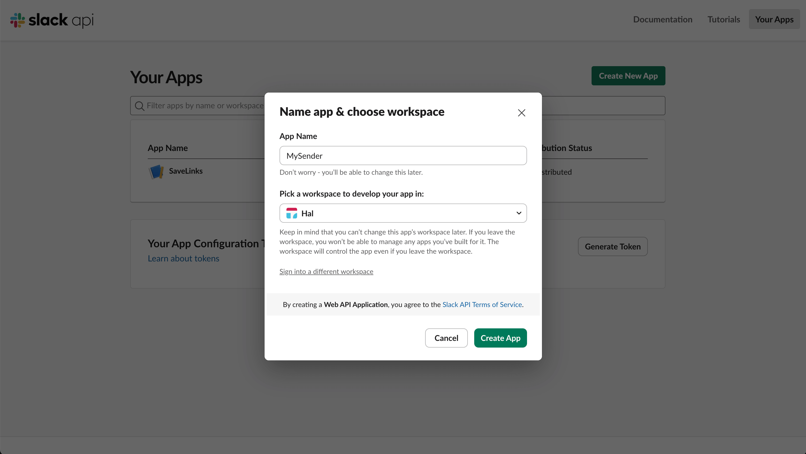
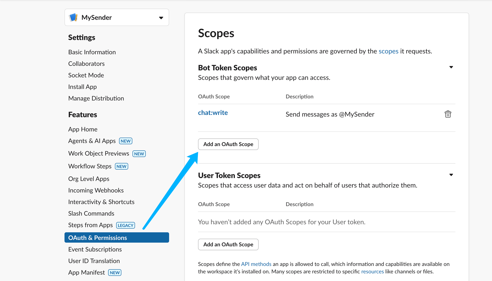
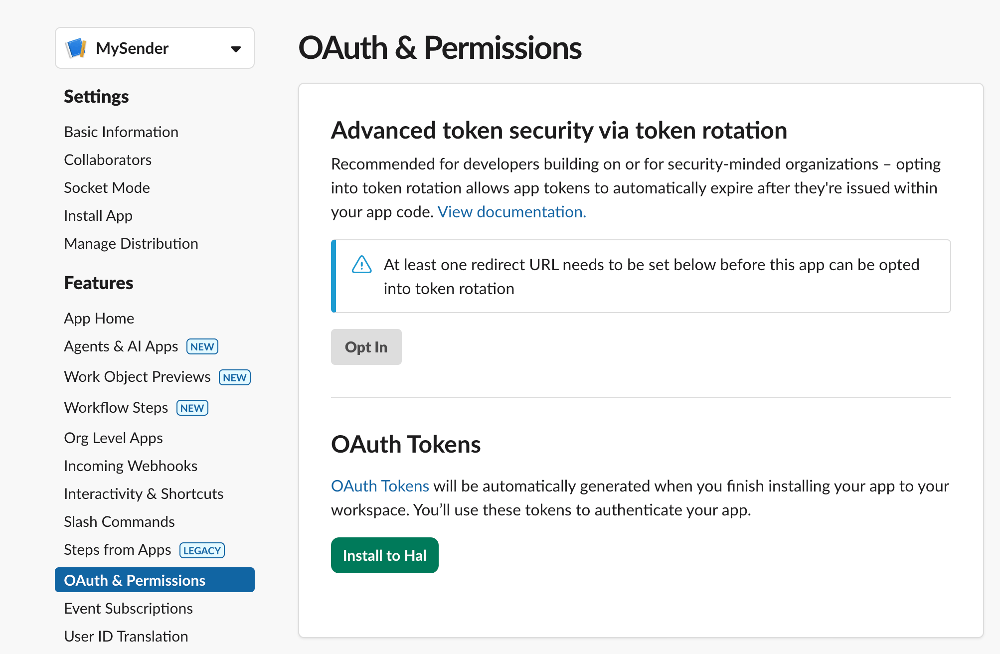
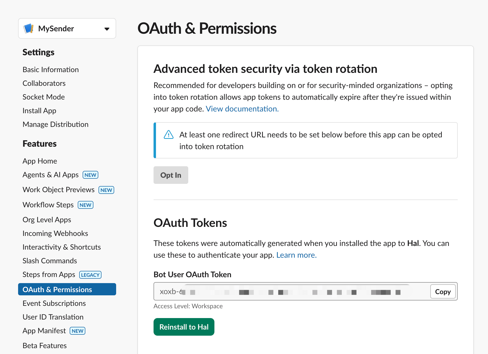
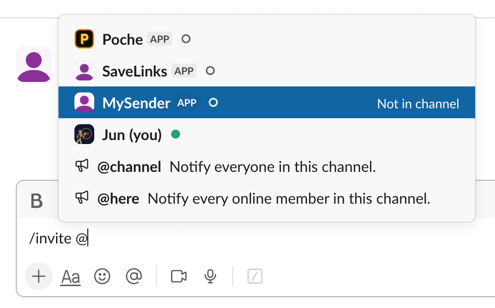
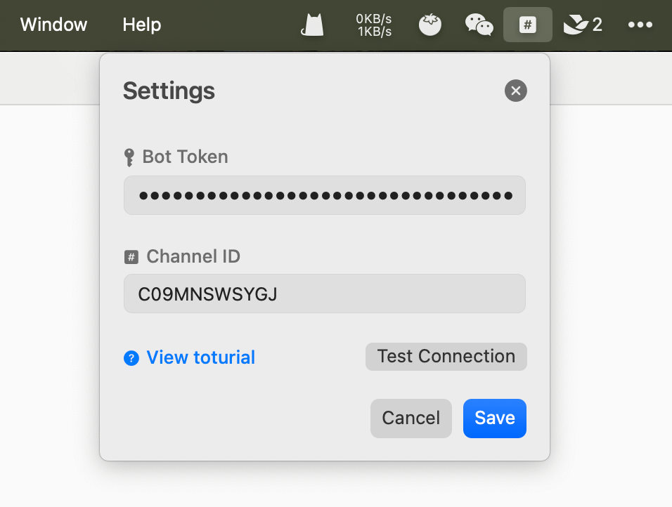

  
  <h3>SendMessageToSlack</h3>
  
Send message to Slack channel in your menubar

## Screenshot

## Download and install

Go to [Releases](https://github.com/hallee9000/SendMessageToSlack/releases) and download the latest `.dmg`. Open it and drag the app to Application folder.

## How to use

1. Go to [Slack app page](https://api.slack.com/apps) and create an app.
  
2. Go to your app detail page and navigate to **OAuth & Permissions** part. In the scopes section add `chat:write` to your bot token scopes.
  
3. Now scroll to the top and click install button to install this bot to your workspace.
  
4. You can see the generated token for now. We will use it later.
  
5. Don't forget to invite this bot to the channel where you want to send message.
  
6. Get the channel id in the address bar, we will use it later.
  
7. Fill the token and channel id in the app, save it, now you can send message from menubar.
  

### Menubar apps by me

- [FigmaActivityCalendar](https://macmenubar.app/app/figma-activity-calendar)
- [SendMessageToSlack](https://macmenubar.app/app/send-message-to-slack)
